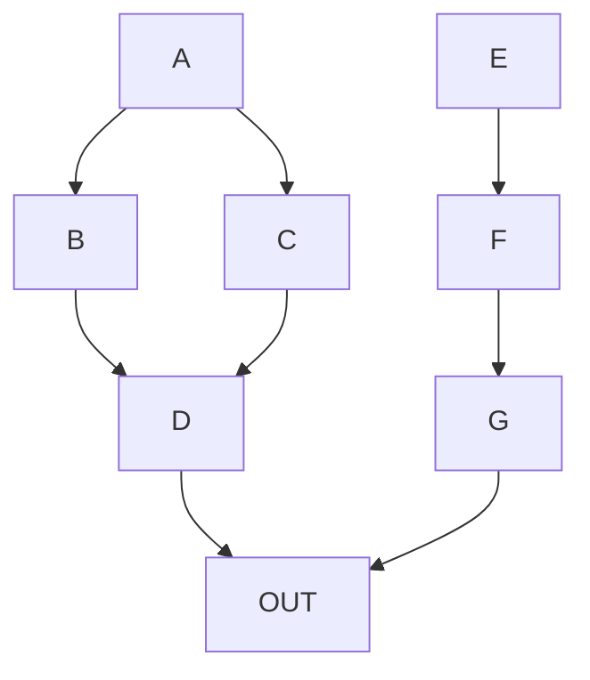

# Markdown Testing

This is where I test things that I learn about markdown.

Contents
 * [Diagrams](#diagrams)
 * [Expand and collapse](#expand-and-collapse)
 * [Footnotes](#footnotes)
 * [Comments](#comments)
 * [Admonitions](#admonitions)

## Diagrams
GitHub markdown supports [Mermaid](https://mermaid-js.github.io/mermaid/#/), "a Javascript based diagramming and charting tool that renders Markdown-inspired text definitions to create and modify diagrams dynamically." Mermaid offers support for some fairly complex graphs and charts and the fact that it's text-based means it's a good deal for accessibility and translation.

### Example simple top-down flowchart
```
graph TD;
      A-->B;
      A-->C;
      B-->D;
      C-->D-->OUT;
      E-->F-->G-->OUT
```
displays as:


### Example left-right flowchart with some customization
```
flowchart LR
    A[Hard edge] -->|Link text| B(Round edge)
    B --> C{Decision}
    C -->|One| D[Result one]
    C -->|Two| E[Result two]
 ```
 displays as:
 ```mermaid
 flowchart LR
    A[Hard edge] -->|Link text| B(Round edge)
    B --> C{Decision}
    C -->|One| D[Result one]
    C -->|Two| E[Result two]
   ```
## Expand and collapse
I'm not a big fan but here it is:

```
<details>
<summary>To make sure markdown is rendered correctly in the collapsed section...</summary>

 1. Put an **empty line** after the `<summary>` block.
 2. *Insert your markdown syntax*
 3. Put an **empty line** before the `</details>` tag
 
</details>
```
displays as:
<details>
<summary>To make sure markdown is rendered correctly in the collapsed section...</summary>

 1. Put an **empty line** after the `<summary>` block.
 2. *Insert your markdown syntax*
 3. Put an **empty line** before the `</details>` tag
 
</details>


## Footnotes
I'm still not sure about footnotes in web content. But they seem to be sticking around. I blame whitepapers. In any event, here's the code for creating footnotes in markdown.
```
The quick brown fox[^1] jumped over the lazy dog[^2].

[^1]: Foxes are red
[^2]: Dogs are usually not red
```
displays as:

The quick brown fox[^1] jumped over the lazy dog[^2].

## Comments
To add a comment, place text inside brackets followed by a colon, a space, and a pound sign (e.g., [comment]: #). Place a blank line before and after a comment.
```
Here's a paragraph that will be visible.

[This is a comment that will be hidden.]: # 

And here's another paragraph that's visible.
```
displays as:

Here's a paragraph that will be visible.

[This is a comment that will be hidden.]: # 

And here's another paragraph that's visible.

## Admonitions
Unless you use some other way and/or customized CSS, you can get some pretty old-school Docbook-like admonitions. But, they're better than nothing.
```
> :warning: **Warning:** Do not push the big red button.

> :memo: **Note:** Sunrises are beautiful.

> :bulb: **Tip:** Remember to appreciate the little things in life.
```
displays as:

> :warning: **Warning:** Do not push the big red button.

> :memo: **Note:** Sunrises are beautiful.

> :bulb: **Tip:** Remember to appreciate the little things in life.


[^1]: Foxes are red
[^2]: Dogs are usually not red
