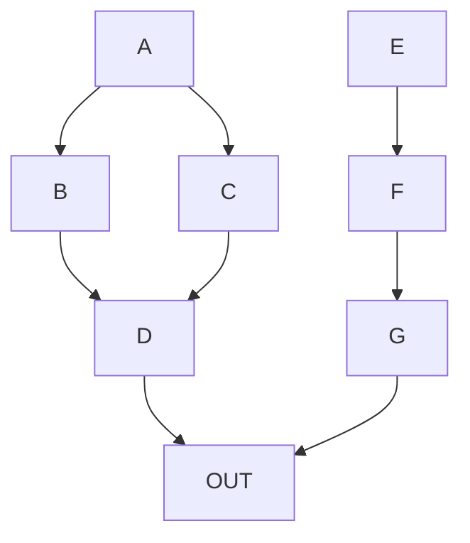

# Markdown Testing
This is where I test things that I learn about markdown.

## Diagrams from markdown text
GitHub markdown supports [Mermaid](https://mermaid-js.github.io/mermaid/#/), "a Javascript based diagramming and charting tool that renders Markdown-inspired text definitions to create and modify diagrams dynamically." Mermaid offers support for some fairly complex graphs and charts and the fact that it's text-based means it's a good deal for accessibility and translation.

### Example simple top-down flowchart
```
graph TD;
      A-->B;
      A-->C;
      B-->D;
      C-->D-->OUT;
      E-->F-->G-->OUT
```
displays as:


### Example left-right flowchart with some customization
```
flowchart LR
    A[Hard edge] -->|Link text| B(Round edge)
    B --> C{Decision}
    C -->|One| D[Result one]
    C -->|Two| E[Result two]
 ```
 displays as:
 ```mermaid
 flowchart LR
    A[Hard edge] -->|Link text| B(Round edge)
    B --> C{Decision}
    C -->|One| D[Result one]
    C -->|Two| E[Result two]
   ```
